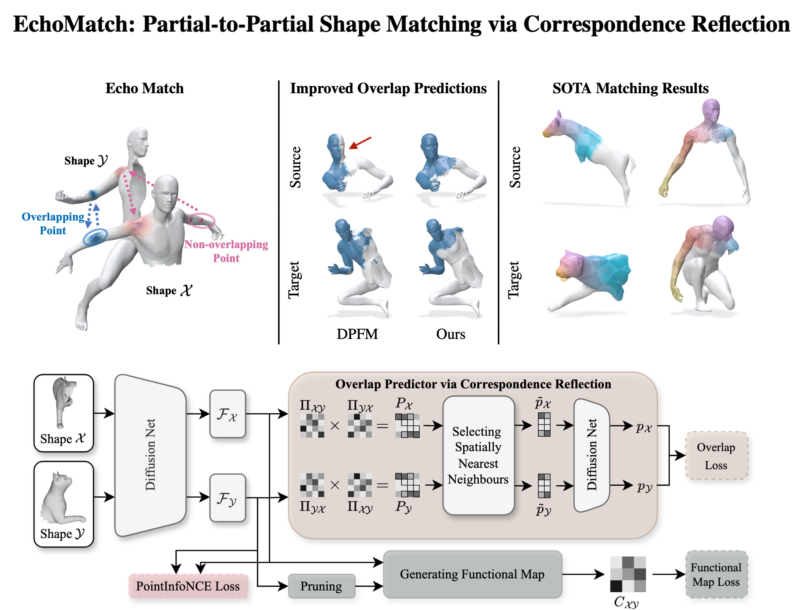

#  [EchoMatch: Partial-to-Partial Shape Matching via Correspondence Reflection](https://echo-match.github.io/) [(CVPR 2025)](https://openaccess.thecvf.com/content/CVPR2025/html/Xie_EchoMatch_Partial-to-Partial_Shape_Matching_via_Correspondence_Reflection_CVPR_2025_paper.html)
<a href='https://echo-match.github.io/'></a>  [](https://xieyizheng.com/media/papers/echomatch/echo_match_paper_reduced.pdf)


<!-- <p align="center">
  
</p>
<p align="center">
  
</p> -->


<p align="center">
  
</p>


## Installation
```bash
conda create -n echo-match python=3.10
conda activate echo-match
conda install -c nvidia cuda-toolkit # nvcc for complile pytorch3d with cuda support
pip install -r requirements.txt
```
**PyTorch3D**
```bash
pip install git+https://github.com/facebookresearch/pytorch3d.git@stable
```
PyTorch3D is only required for computing DINO features using the [Diff3F](https://github.com/niladridutt/Diffusion-3D-Features) renderer. The installation can be tricky. If you run into installation issues, please check out the [installation guide](https://github.com/facebookresearch/pytorch3d/blob/main/INSTALL.md). 


**Optional**: If you are using a cluster with mixed GPU types, you can specify all your GPU architectures to ensure compatibility, eg:
```bash
export TORCH_CUDA_ARCH_LIST="6.0;6.1;7.0;7.5;8.0;8.6+PTX" # much longer compile time
pip install git+https://github.com/facebookresearch/pytorch3d.git@stable 
```

## Datasets

To download and set up the datasets:
1. Run the following script [download_datasets.sh](download_datasets.sh) to automatically download and place the [CP2P24](https://huggingface.co/datasets/xieyizheng/CP2P24) and [PARTIALSMAL](https://github.com/vikiehm/gc-ppsm)  datasets:
   ```bash
   bash download_datasets.sh
   ```
2. For the BeCoS dataset, please follow the official instructions at [BeCoS repository](https://github.com/NafieAmrani/becos-code) to manually download and generate the dataset.

All datasets placed under `../data/`
```Shell
├── data
    ├── CP2P24
    ├── PARTIALSMAL
    ├── BeCoS
```
We thank the original dataset providers for their contributions to the shape analysis community, and that all credits should go to the original authors.

## Pre-trained Models

You can find all pre-trained models in [checkpoints](checkpoints/echo_match/) and config files in [options](options/echo_match/) for reproducibility.

In the following, we show an example of using echo-match on the PARTIALSMAL dataset using DINO features.


## Preprocess
```python
python preprocess.py --opt options/echo_match/train/echo_match_psmal_dino.yaml
```
With a single gpu takes around 50 mins on train split and 20 mins on test split.

Optional: `parallel_preprocess.py` with `worker_id` and `num_workers`.

## Train
```python
python train.py --opt options/echo_match/train/echo_match_psmal_dino.yaml
```
The experiments will be saved in [experiments](experiments) folder. You can visualize the training process in tensorboard or via wandb.
```bash
tensorboard --logdir experiments/
```

## Test
```python
python test.py --opt options/echo_match/test/echo_match_psmal_dino.yaml
```
The results will be saved in [results](results) folder.


## Visualization

Headless 
```python
python visualize.py --opt options/echo_match/test/echo_match_psmal_dino.yaml
```
Interactive
```python
python visualize.py -i --opt options/echo_match/test/echo_match_psmal_dino.yaml
```
The visualizations will be saved in [visualizations](visualizations) folder.


<p align="center">
  
</p>

<!-- ## Pretrained models
You can find all pre-trained models in [checkpoints](checkpoints) for reproducibility. -->

## Acknowledgement
The framework implementation is adapted from [Unsupervised Learning of Robust Spectral Shape Matching](https://github.com/dongliangcao/Unsupervised-Learning-of-Robust-Spectral-Shape-Matching/), [Deep Partial Functional Maps](https://github.com/pvnieo/DPFM/), [Partial-to-Partial Shape Matching with Geometric Consistency](https://github.com/vikiehm/gc-ppsm/) and [Hybrid Functional Maps for Crease-Aware Non-Isometric Shape Matching](https://github.com/xieyizheng/hybridfmaps).

The implementation of DiffusionNet is based on [the official implementation](https://github.com/nmwsharp/diffusion-net).

The implementation of visualization is based on [polyscope](https://github.com/nmwsharp/polyscope-py).

We thank the original authors for their contributions to this code base.

<!-- : [Nickolas Sharp](https://github.com/nmwsharp/), [Florine Hartwig](https://github.com/flrneha) and [Dongliang Cao](https://github.com/dongliangcao), -->

## Attribution
Please cite our paper when using the code. You can use the following bibtex
```
@inproceedings{xiehm2025echomatch,
  title={EchoMatch: Partial-to-Partial Shape Matching via Correspondence Reflection},
  author={Xie, Yizheng and Ehm, Viktoria and Roetzer, Paul and El Amrani, Nafie and Gao, Maolin and Bernard, Florian and Cremers, Daniel},
  booktitle={Proceedings of the Computer Vision and Pattern Recognition Conference},
  pages={11665--11675},
  year={2025}
}

```